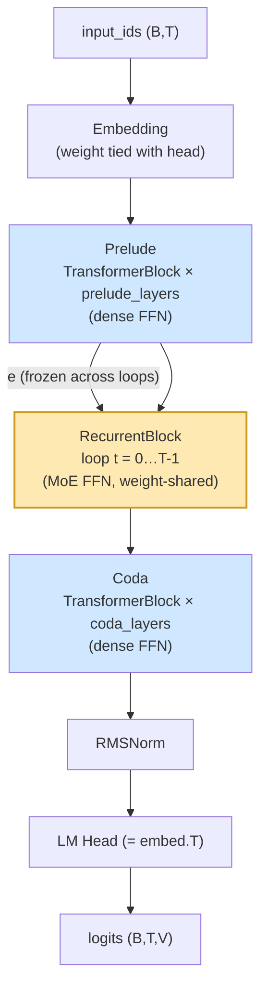
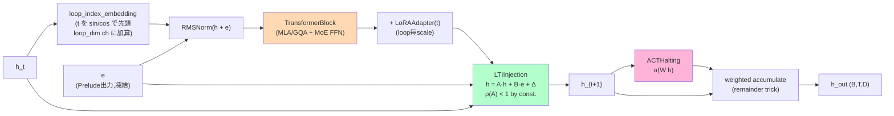
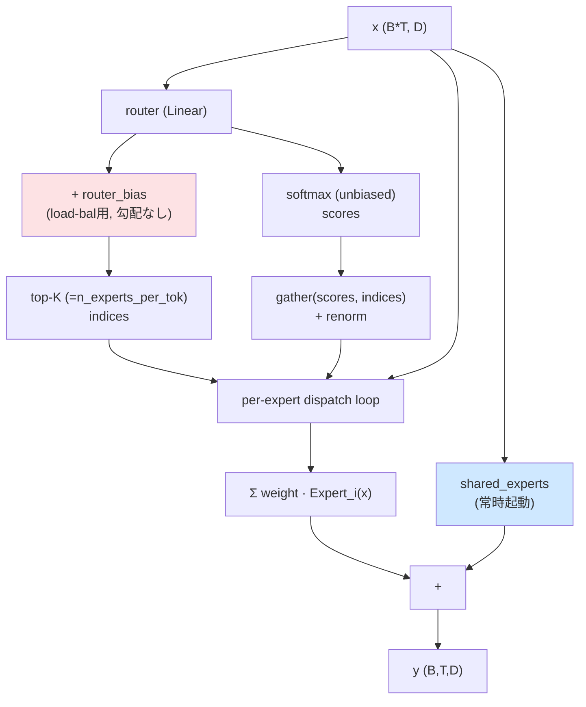
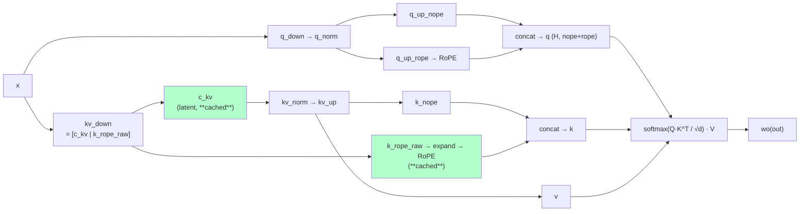
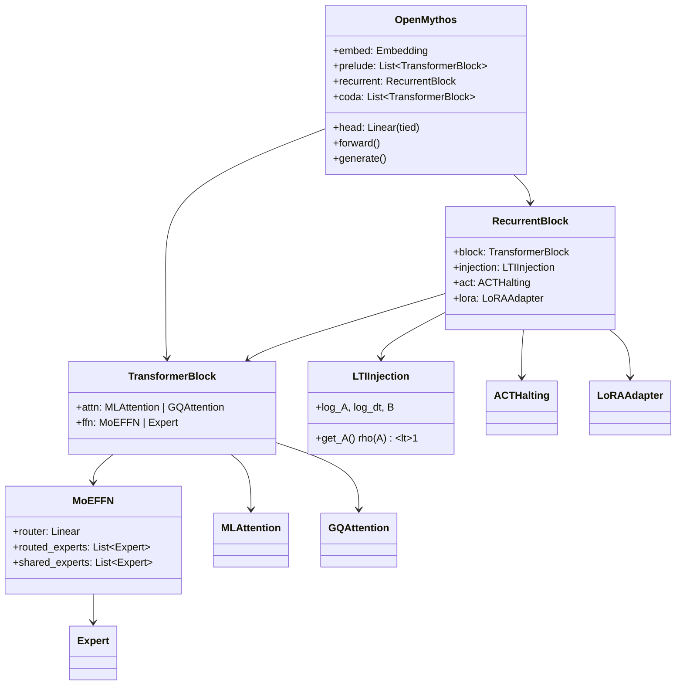
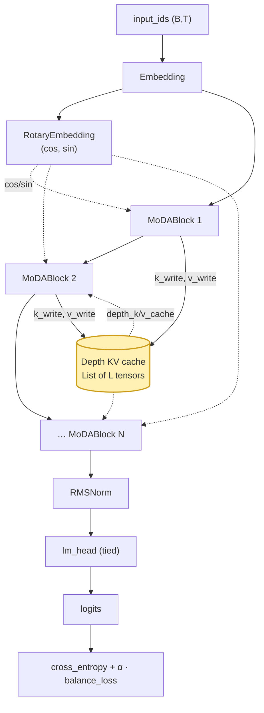
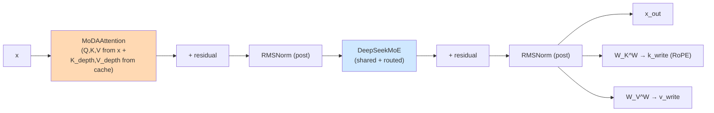

OpenMythosのソースを解析しました。プロジェクトはClaude Mythosアーキテクチャの理論的再構成で、Recurrent-Depth Transformer (RDT) を中心に、別系統の Mixture-of-Depths Attention (MoDA) も同梱しています。

---

# 1. プロジェクト全体構造

```
open_mythos/
├── main.py        ← メインモデル: OpenMythos (RDT = Prelude + Loop + Coda)
├── moda.py        ← 別系統モデル: MoDAModel (Mixture-of-Depths Attention + DeepSeek MoE)
├── variants.py    ← 1B〜1Tの構成プリセット (mythos_1b, mythos_3b, …, mythos_1t)
├── tokenizer.py   ← HuggingFace AutoTokenizer ラッパ (gpt-oss-20b)
└── __init__.py    ← 公開API
training/3b_fine_web_edu.py  ← FineWeb-Edu 上の 3B 学習スクリプト
tests/                       ← 単体テスト + ベンチ
docs/                        ← API リファレンス, データセット
```

`main.py` と `moda.py` は**独立した別アーキテクチャ**として共存しており、main.py がREADMEで宣伝されているメインの「Mythos」です。

---

# 2. main.py の内部構造グラフ

## 2.1 全体フロー (OpenMythos)



- **Prelude / Coda** … 通常のスタック型 Transformer
- **RecurrentBlock** … 1ブロックの重みを T 回ループ。`e` は毎ステップ注入される

## 2.2 RecurrentBlock 内部 (1 イテレーション)



カギになる更新式:
```
h_{t+1} = A · h_t  +  B · e  +  TransformerBlock(RMSNorm(h_t + e))
```
A は ZOH離散化により `A = exp(-exp(log_dt + log_A))` ∈ (0,1) を保証 → スペクトル半径 ρ(A) < 1。

## 2.3 MoEFFN (DeepSeek-V3 風 aux-loss-free routing)



## 2.4 MLAttention (DeepSeek-V2 Multi-Latent Attention)


KV キャッシュは `c_kv (kv_lora_rank)` + `k_rope` のみ → 通常GQAの ~10–20倍メモリ削減。

## 2.5 クラス依存関係



---

# 3. moda.py の内部構造グラフ

`moda.py` は完全に独立したモデル。各層の出力 X_lᵒᵘᵗ から書き込まれる **深さ方向KVキャッシュ** に同一トークン位置で attend する点が特徴です。



**MoDABlock** 内部:


注意点: **単一 softmax** で sequence-KV (T個) と depth-KV (L層分) を結合する unified attention。

---

# 4. 関連用語の解説

| 用語 | 意味 | 本リポでの位置 |
|---|---|---|
| **RDT (Recurrent-Depth Transformer)** | 一部レイヤを T 回ループする Transformer。CoT を**潜在空間**で行う等価物 | `OpenMythos` 全体 |
| **RoPE (Rotary Position Embedding)** | Q,K の各偶数次元ペアを位置に応じた複素数で回転して位置情報を埋め込む手法 | `precompute_rope_freqs`, `apply_rope` |
| **GQA (Grouped Query Attention)** | KVヘッド数を Qヘッド数より減らしてKVキャッシュを縮小 | `GQAttention` |
| **MLA (Multi-Latent Attention)** | KV を低ランク latent に圧縮して**latent だけ**キャッシュ。RoPE は別ヘッド次元に分離 (decoupled RoPE) | `MLAttention` |
| **MoE (Mixture of Experts)** | router でトークン毎に top-K 専門家を選択。**fine-grained** = 各専門家を小さく数を増やす, **shared expert** = 常時起動の共通専門家 | `MoEFFN`, `DeepSeekMoE` |
| **Aux-loss-free load balancing** | router logits に学習バイアスを加え、選択は偏らず**重みは無バイアスのscoreから取る**手法 (DeepSeek-V3) | `MoEFFN.router_bias`, `DeepSeekGate.bias` |
| **ACT (Adaptive Computation Time)** | 位置ごとに halting probability を学習。簡単なトークンは早く打ち切り、難しいトークンは深くループ。Turing-完備性に関与 | `ACTHalting` |
| **LTI (Linear Time-Invariant) injection** | 再帰更新を線形動的系として扱い、A をパラメタ化で `ρ(A)<1` を保証して再帰の発散を防ぐ (Parcae) | `LTIInjection` |
| **ZOH discretization** | 連続→離散の零次ホールド変換。`A_d = exp(Δt · A_c)` | `LTIInjection.get_A` |
| **LoRA (Low-Rank Adaptation)** | `down(x) @ B` の低ランク差分。本実装では**ループ深さ毎**に scale を変えて重み共有を緩める | `LoRAAdapter` |
| **Loop-index embedding** | RoPE のループ深さ版。共有重みの再帰ブロックを各ループで挙動を変えるための位置(深さ)信号 | `loop_index_embedding` |
| **RMSNorm** | RMS だけで正規化。LayerNorm より高速で平均減算なし | `RMSNorm` |
| **SwiGLU** | `down(SiLU(gate(x)) ⊙ up(x))` の gated FFN | `Expert`, `DeepSeekExpert` |
| **MoDA (Mixture-of-Depths Attention)** | 各クエリが「同層のシーケンスKV」と「全先行層の同位置の深さKV」を**1つの softmax** で結合参照 | `MoDAAttention`, `MoDABlock` |
| **Weight tying** | embedding と lm_head の重みを共有 | `OpenMythos.head.weight = self.embed.weight` |
| **Flash Attention 2** | I/O-aware exact attention カーネル。本実装では GQA 経路でオプショナル | `flash_attn_func` (GQAttention) |

---

# 5. 公式資料へのリンク

## 5.1 アーキテクチャ論文

| トピック | 論文 / 公式リソース |
|---|---|
| Recurrent-Depth Transformer (汎化) | [Loop, Think, & Generalize (arXiv:2604.07822)](https://arxiv.org/pdf/2604.07822) |
| Looped Transformer の潜在思考 | [Reasoning with Latent Thoughts (arXiv:2502.17416)](https://arxiv.org/abs/2502.17416) |
| Parcae (LTI 安定化) | [arXiv:2604.12946](https://arxiv.org/abs/2604.12946) / [プロジェクトページ](https://sandyresearch.github.io/parcae/) |
| Universal Transformer (ACT 起源) | [arXiv:1807.03819](https://arxiv.org/pdf/1807.03819) |
| Adaptive Computation Time | [Graves 2016, arXiv:1603.08983](https://arxiv.org/abs/1603.08983) |
| Relaxed Recursive Transformers (深さ別 LoRA) | [arXiv:2410.20672](https://arxiv.org/pdf/2410.20672) |
| Latent CoT (Coconut) | [arXiv:2412.06769](https://arxiv.org/abs/2412.06769) |
| **RoPE** (RoFormer) | [arXiv:2104.09864](https://arxiv.org/abs/2104.09864) |
| **RMSNorm** | [arXiv:1910.07467](https://arxiv.org/abs/1910.07467) |
| **GQA** (Ainslie+ 2023) | [arXiv:2305.13245](https://arxiv.org/abs/2305.13245) |
| **MLA** (DeepSeek-V2) | [arXiv:2405.04434](https://arxiv.org/abs/2405.04434) |
| **DeepSeekMoE** (fine-grained + shared) | [arXiv:2401.06066](https://arxiv.org/abs/2401.06066) |
| DeepSeek-V3 (aux-loss-free routing) | [arXiv:2412.19437](https://arxiv.org/abs/2412.19437) |
| **SwiGLU** | [arXiv:2002.05202](https://arxiv.org/abs/2002.05202) |
| **Flash Attention 2** | [arXiv:2307.08691](https://arxiv.org/abs/2307.08691) |
| **MoDA** (Mixture-of-Depths Attention) | [arXiv:2603.15619](https://arxiv.org/abs/2603.15619) |
| LoRA | [arXiv:2106.09685](https://arxiv.org/abs/2106.09685) |

## 5.2 公式実装 / 公式ドキュメント

| 項目 | URL |
|---|---|
| OpenMythos 自身 | [github.com/The-Swarm-Corporation/OpenMythos](https://github.com/The-Swarm-Corporation/OpenMythos) |
| 内部APIリファレンス | [docs/open_mythos.md](docs/open_mythos.md) (リポジトリ内) |
| データセットガイド | [docs/datasets.md](docs/datasets.md) (リポジトリ内) |
| DeepSeek-V3 公式実装 | [github.com/deepseek-ai/DeepSeek-V3](https://github.com/deepseek-ai/DeepSeek-V3) |
| Flash Attention 公式 | [github.com/Dao-AILab/flash-attention](https://github.com/Dao-AILab/flash-attention) |
| MoDA 公式 (Triton kernel あり) | [github.com/hustvl/MoDA](https://github.com/hustvl/MoDA) |
| PyTorch | [pytorch.org/docs](https://pytorch.org/docs) |
| HuggingFace transformers | [huggingface.co/docs/transformers](https://huggingface.co/docs/transformers) |
| `openai/gpt-oss-20b` (デフォルトトークナイザ) | [huggingface.co/openai/gpt-oss-20b](https://huggingface.co/openai/gpt-oss-20b) |
| 学習対象 FineWeb-Edu | [huggingface.co/datasets/HuggingFaceFW/fineweb-edu](https://huggingface.co/datasets/HuggingFaceFW/fineweb-edu) |

---

# 6. まとめ — 設計上のポイント

1. **3段構成** (Prelude → 共有重みLoop → Coda) で**深さをパラメータ数から切り離す**。推論時に `n_loops` を増やすだけで深い推論ができる (depth extrapolation)。
2. **再帰の安定化を構造的に保証** する `LTIInjection` (`ρ(A)<1` by construction) は Parcae の中心的アイデア。
3. **同じ重みでループ毎に挙動を変える**ための仕掛けが3つ重ねられている: `loop_index_embedding` (位置信号) + `LoRAAdapter` (低ランク差分) + `LTIInjection.B*e` (常時注入)。
4. **breadth は MoE で、depth はループで** 担保 — DeepSeekMoE 風の fine-grained + shared experts を再帰ブロックの FFN に配置。
5. **2系統のアテンション** を切替可: `attn_type="mla"` (KV圧縮で長文向け) / `"gqa"` (Flash-Attn 2併用可)。
6. `moda.py` は別アーキテクチャで、層をまたぐ深さ KV キャッシュに統一 softmax で attend する Mixture-of-Depths Attention の実装。