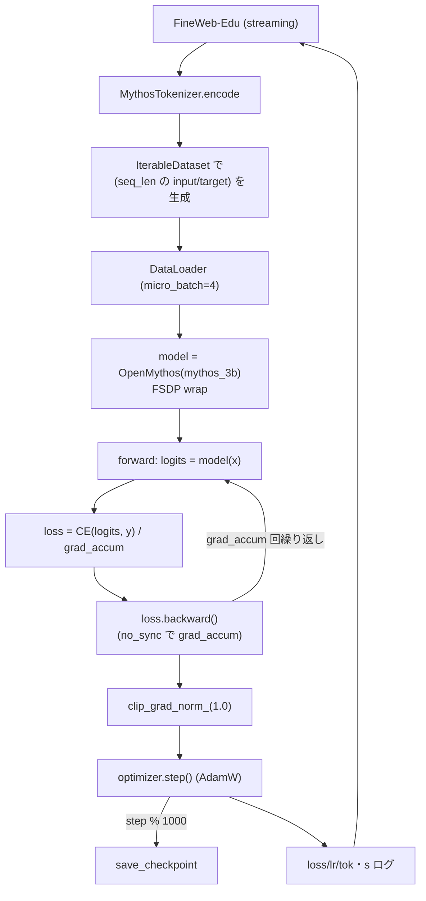

`training/3b_fine_web_edu.py` は **OpenMythos モデルを訓練するスクリプト**です。

## 訓練対象は OpenMythos か

明確に Yes。該当箇所:

```python
from open_mythos import OpenMythos
from open_mythos.variants import mythos_3b
...
cfg = mythos_3b()
cfg.vocab_size = vocab_size
cfg.max_seq_len = seq_len
model = OpenMythos(cfg)        # ← 3B 構成で OpenMythos をインスタンス化
```

その後、`logits = model(x)` で `OpenMythos.forward` を呼び、cross-entropy で勾配を流して `optimizer.step()` しています。

## 訓練の概要

| 項目 | 値 / 内容 |
|---|---|
| モデル | `OpenMythos(mythos_3b())` (dim=3072, 24 heads, MLA, 64 experts, 16 loops) |
| トークナイザ | `MythosTokenizer` = `openai/gpt-oss-20b` の HF AutoTokenizer |
| データセット | `HuggingFaceFW/fineweb-edu` の `sample-10BT` をストリーミング読込 |
| タスク | 次トークン予測 (`y = x` の 1 トークンシフト) |
| 損失 | `cross_entropy(logits.view(-1, V), y.view(-1))` |
| 最適化 | AdamW (fused, β=(0.9, 0.95), wd=0.1), peak lr=3e-4 |
| LR schedule | linear warmup 2000 step → cosine decay |
| 並列化 | FSDP (FULL_SHARD) + 自動ラップ対象 = `TransformerBlock`, `RecurrentBlock` |
| 混合精度 | bf16 (H100/A100), 非対応なら fp16 |
| バッチ | micro_batch=4, grad_accum で global ≈ 256 系列、seq_len=2048 |
| 目標 | 30B トークン (chinchilla を looped 用に調整) |
| チェックポイント | 1000step毎に保存 (FSDP 全状態 gather + atomic write、最新3つ保持) |
| 起動 | 単GPU: `python training/3b_fine_web_edu.py` / 多GPU: `torchrun --nproc_per_node=N` |

## 訓練ループの流れ



## 補足: 注意点

1. **`OpenMythos.forward` には `n_loops` を渡していない** → デフォルトの `cfg.max_loop_iters = 16` で全ループを回して訓練しています。
2. **ACT halting は KV cache なしの forward では `halted.all()` 時に early-exit** しますが、訓練中は cache=None なので動作。
3. **start_pos=0** が暗黙の既定 (forward の引数省略時) で、訓練は常にプリフィル扱い。
4. `OpenMythos.generate` は使われない (推論時のみ)。

要約: 「`open_mythos.OpenMythos` を `mythos_3b` 設定で構築 → FineWeb-Edu の次トークン予測で FSDP + AdamW 学習」を行うスクリプトです。